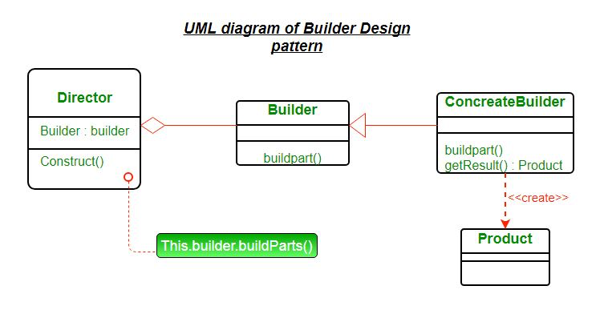
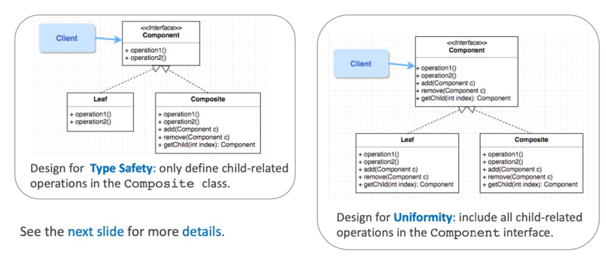
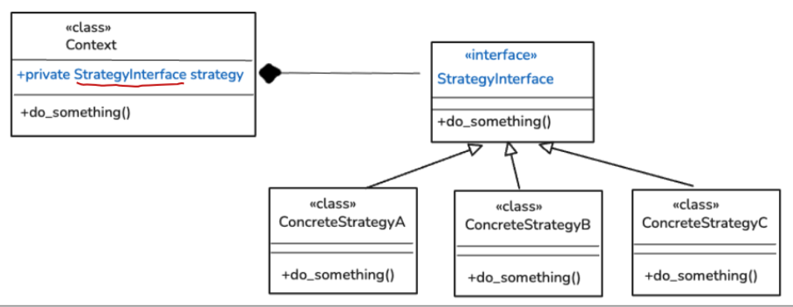
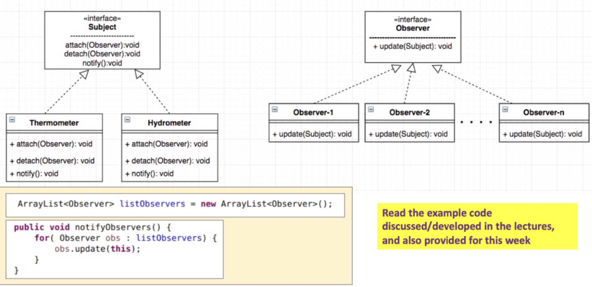

---
markmap:
  maxWidth: 300
---

 # root((Architectural Foundations))
 ### Core Design Principles
 ##### SOLID Principles
 ###### Single Responsibility :: SRP
 ###### Open/Closed :: OCP
 ###### Liskov Substitution :: LSP
 ###### Interface Segregation :: ISP
 ###### Dependency Inversion :: DIP
 ##### Law of Demeter
 ###### Least Knowledge
 ### Hallmarks of Good Design
 #### Modular Design: self contained units, exposing only whats necessary
 ###### High Cohesion
 ###### Loose Coupling
 ### Design Patterns: solves architectural/design problems
 ##### Creational
 ###### Factory Method: Builds an interface for creating objects in a superclass, but allows subclasses to alter type of objects created
 ###### Abstract Factory: Builds an abstract class where families of objects can be created without specifying their concrete classes
 ###### Builder: Let users 
 ###### Singleton
 ##### Structural
 ###### Composite
 - Lets you treat individual objects (leafs) and compositions of objects (groups) uniformly by using a common interface
 
 - promotes: *Uniformity, Scalability, Reusability*
 ###### Decorator
 - Decorator pattern interface has the same supertype as the object that it decorates, we parse around a decorated object in place of the original object
 ##### Behavioral
 ###### Strategy 
 - Defines a family of algorithms, **encapsulates** each one, and makes them interchangeable at runtime. Methods can be called upon the encapsulated object
 
 - promotes: 
    - Encapsulation variation; more classes, Method overriding in classes
    - ==*OCP*, *COI*, seperation of concern==
    - ==Scalable + reusable==
 ###### Observer
 - Handles event-driven systems, an object the subject maintains a list of its dependents observers. Changes in state of the subject will notify all the observers usually by update()
 
 - Passing Data: Push data (all observers implement using push data), Pull data (subject passes an instance of itself, observers must pull data)
 ### Refactoring & Quality
 ##### Refactoring methods 
 ###### Extract method: extract into seperate methods
 ###### Move method: move methods to class that use it the most
 ###### Replace Temp with Query: move temporary expressions into methods
 ####### Replace conditionals with polymorphism: Subclass inheritance, Strategy pattern
 ######### excessive switch cases violate OCP
 ####### Favour composition over inheritance
 ##### Refactoring Cycle: Identify smell, write tests to confirm, refactor Changes, rerun tests, repeat
 ##### Common Code Smells
 ###### Refused Bequest: subclass inherits inappropriate behaviour
 ###### Long Parameter List: create a data class and parse an instance of that class instead
 ###### Duplicated Code:
 1. Same code in multiple methods -> Extract method
 2. Same code in two subclasses of the same level -> Extract method into superclass
    - Pull up field: move up fields
    - Pull up method: move up methods
        - Inside constructor -> use super constructor + parameterise fields 
        - Similar but not exact code -> Template Method: Allow the superclass to hold skeleton, subclasses override methods
        - Algorithms differ -> Strategy pattern: create a strategy class and create instance

 ###### Long Method/Class: Extract method/Extract class
 ###### Feature Envy: *Move method* on class that owns/holds majority the data, if only a part of the method use *Extract Method* then *Move Method*. ==Method invokes several methods on another object -> unnecessary coupling + breaks encapsulation==
 ###### Divergent change: One class modified repeatedly for unrelated reasons -> *Extract class* by responsibility
 ###### Shotgun Surgery: Small changes require updating multiple classes causing ==brittle code + low maintainability== -> Consolidate related changes into a single class using *Move Method, Move Field, Strategy Pattern, Shared Abstractions, Inline Method (put shared methods into a singular class and other class hold an instance of the singular class)
 ### Modern Paradigms
 ##### Functional Paradigm
 ####### Lambda Expressions
 ####### Functional Interfaces
 ####### Streams and Pipelines
 ##### Asynchronous Design
 ####### Independent Execution
 ####### Callbacks
 ####### Event-Driven :: Kafka